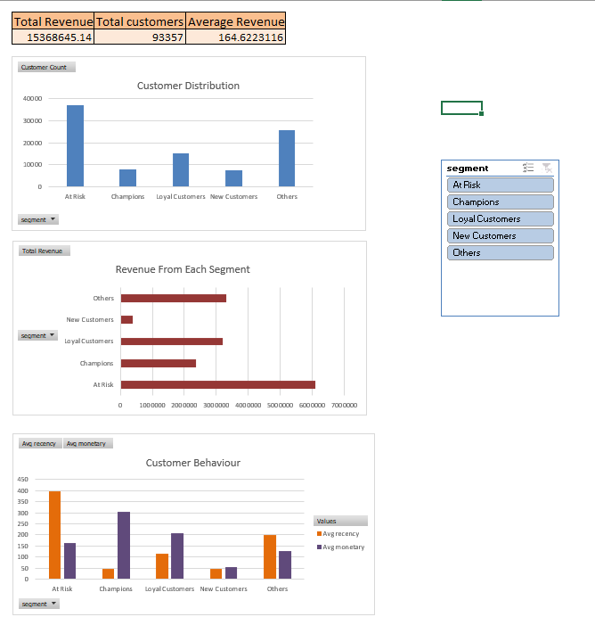

# E-commerce Customer Analytics & Segmentation (SQL, Python, Excel)

# Overview
This project analyzes customer behavior and business performance in an e-commerce dataset using SQL, Python, and Excel.
It combines exploratory data analysis (revenue trends, product performance, customer insights) with RFM (Recency, Frequency, Monetary) analysis to segment customers and identify high-value, loyal, and at-risk users.
The project concludes with an interactive Excel dashboard for business decision-making.

# Business Problem
E-commerce businesses often struggle with understanding customer behavior, identifying high-value users, and improving customer retention.
This project aims to:
- Analyze sales and customer patterns
- Identify revenue-driving segments
- Detect customers at risk of churn
- Support targeted marketing strategies

# Dataset Used
Brazilian E-Commerce Public Dataset by Olist
https://www.kaggle.com/datasets/olistbr/brazilian-ecommerce

# Tools Used
- SQL (data extraction & transformation)
- Python (Pandas, Matplotlib, Seaborn)
- Excel (dashboard & visualization)

# Process
1. Cleaned and filtered transactional data using SQL
2. Created RFM metrics (Recency, Frequency, Monetary)
3. Performed customer segmentation using Python
4. Built visualizations to analyze customer behavior
5. Developed an interactive Excel dashboard using Pivot Tables and Slicers

# RFM Analysis
RFM stands for:
- Recency: How recently a customer made a purchase
- Frequency: How often a customer makes purchases
- Monetary: How much a customer spends
Customers were scored on each metric (1–5) and segmented based on their behavior.

# Customer Segments
- Champions: Recent and high-value customers
- Loyal Customers: Regular customers with consistent spending
- New Customers: Recently acquired customers
- At Risk: Customers who have not purchased recently
- Others: Customers with average behavior

# Key Insights
- Majority of customers are one-time buyers, indicating low retention
- A small segment of high-value customers contributes a large portion of revenue
- At-risk customers form a significant portion of the base, highlighting churn risk
- Recently active customers show higher engagement and spending patterns

# Key Takeaways
- Customer retention is a major opportunity area
- A small segment of customers contributes significantly to revenue
- Marketing strategies are necessary to prevent churn



# Project Structure
```
ecommerce-data-analytics/
│
├── data/
│   ├── rfm_customer_analysis.xlsx
│
├── sql/
│   ├── RFM_queries.sql
│   ├── analytics_queries.sql
|   |__ creating_tables.sql
|   |__ creating_index.sql
|   |__ data_validation.sql
|   |__ data_exploration.sql
│
├── python/
│   ├── RFM_analysis.py
│
├── images/
│   ├── dashboard.png
│   ├── revenue_by_segment.png
│   ├── segment_distribution.png
│   ├── recency_vs_monetary.png
│
├── README.md
```

# How to run
1. Execute SQL scripts to generate the base dataset
2. Run the Python notebook to perform RFM analysis
3. Open the Excel file to explore the dashboard
